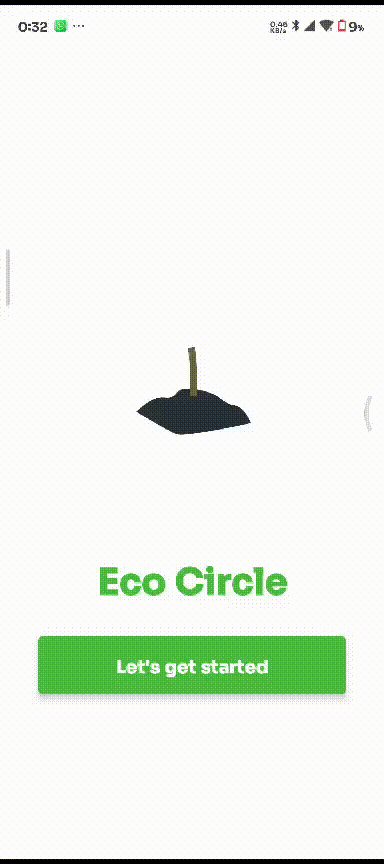
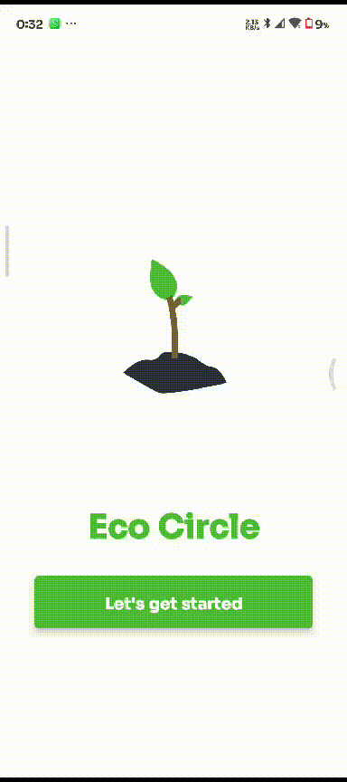
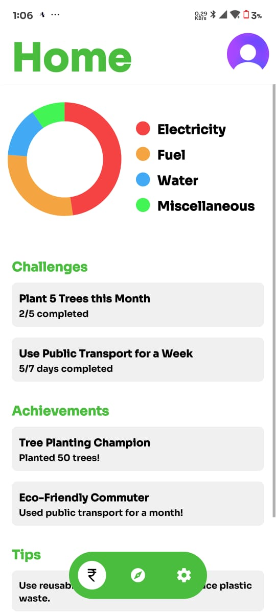
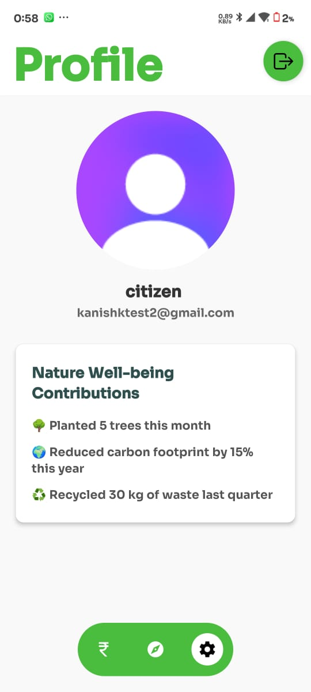

# Eco-Circle App 🌿

**Eco-Circle** is a mobile application designed to inspire sustainable living and increase environmental awareness. Built with **React Native**, the app empowers users to track their eco-friendly habits, manage budgets, participate in environmental challenges, and access helpful tips for leading a greener lifestyle.

## 🌟 Features

- **User Authentication**: Secure sign-in and account management using **Clerk**.
- **Budget Tracking**: Visualize and track your spending on eco-friendly initiatives through an interactive donut chart.
- **Eco Challenges**: Join various eco-friendly challenges, monitor your progress, and stay motivated.
- **Achievements**: Celebrate your sustainable living milestones and accomplishments.
- **Sustainability Tips**: Learn practical tips for improving your environmental footprint.

## 📱 Screenshots & GIFs

### Landing Page

- 
- 

### Home & Profile Pages

- 
- 

## 🛠 Technologies Used

- **React Native: Core framework for building the mobile app.**
- **Expo**: Simplifies React Native app development and testing.
- **Clerk**: User authentication and account management.
- **react-native-gifted-charts**: For dynamic donut chart visualizations in the budget tracker.

